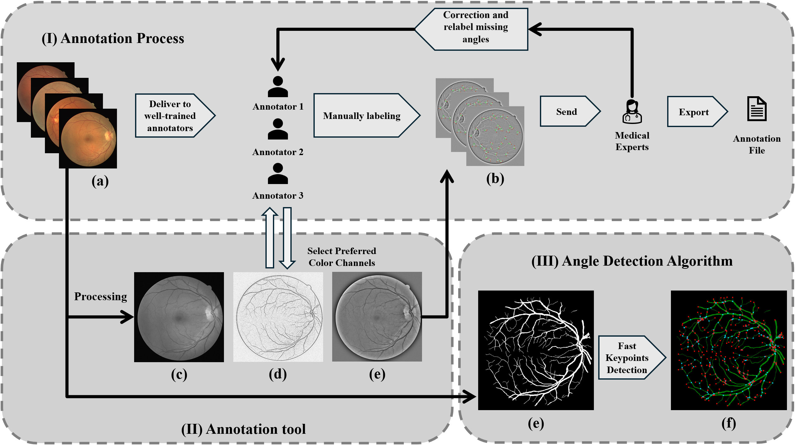
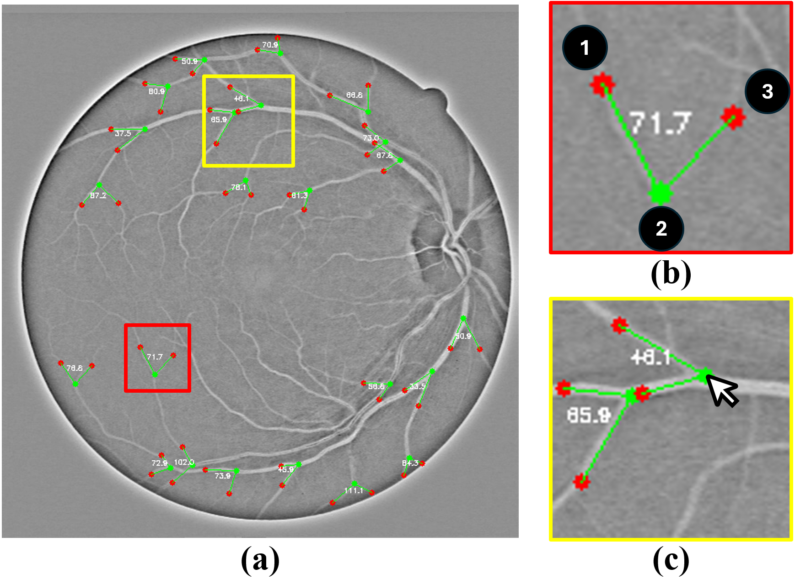

# RBAD - A Dataset and Benchmark for Retinal Vessels Branching Angle Detection

We offer an open-source annotation tool and a benchmark dataset comprising 40 images annotated with retinal branching angles. Additionally, this project presents a novel method for detecting retinal branching angles using a self-configured image processing technique. Our methodology for retinal branching angle detection and calculation is detailed, followed by a benchmark analysis comparing our method with previous approaches. 

# Project Overview
</img>

# Retinal Vessel Annotation Tool
This is an annotation tool designed to calculate retinal vessel bifurcation angles
</img>

# Retinal Vessel Angel Detection
The main function of retinal angle detection

</img>
